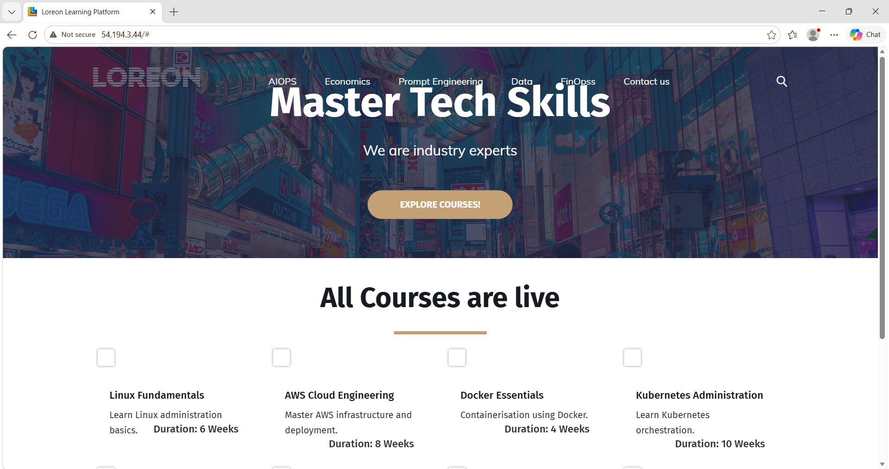
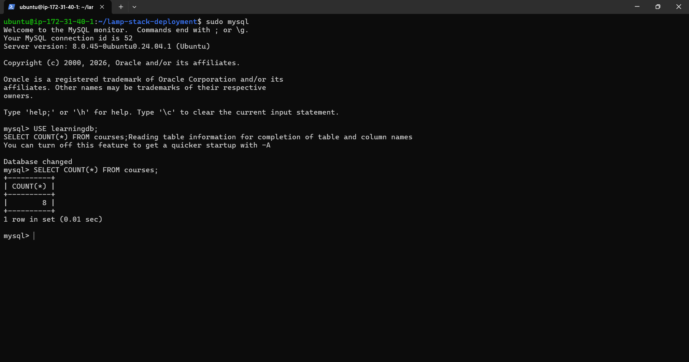
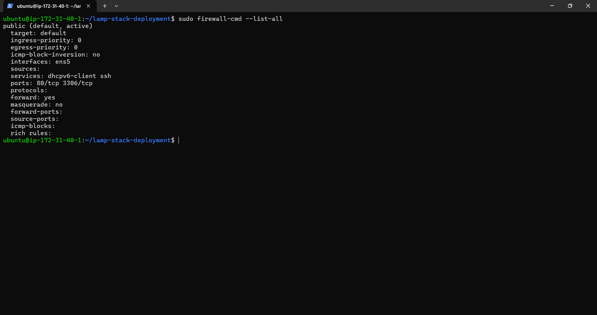
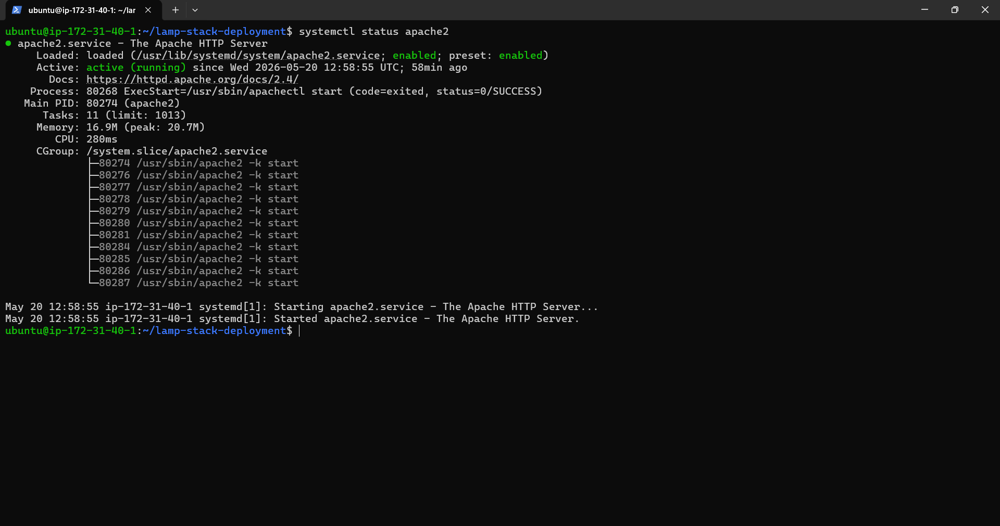

# LAMP Stack Deployment Automation

Automated LAMP stack deployment for the Loreon Learning Platform using Bash scripting on Ubuntu 24.04.

This project provisions Apache, MySQL, PHP, and firewalld, deploys the Loreon Learning application from GitHub, configures the database, inserts seed course data, and prepares the server for live web access on AWS EC2.

---

# Features

- Automated Apache installation and configuration
- Automated MySQL database provisioning
- PHP and php-mysql deployment
- firewalld configuration
- GitHub-based application deployment
- Automatic database seeding
- Idempotent deployment workflow
- Repeatable redeployment support
- Deployment logging
- Apache permission management

---

# Stack

- Ubuntu 24.04
- Apache2
- MySQL
- PHP
- firewalld
- Bash
- Git
- AWS EC2

---

# Application Repository

https://github.com/Loreon-Learning-c001-26-07/loreon-learning-platform.git

---

# Deployment Flow

Infrastructure Provisioning  
→ Firewall Configuration  
→ Database Provisioning  
→ Application Deployment  
→ Apache Restart  
→ Live Application Access

---

# Deploy Pre-Requisites

Allow the following ports in the AWS Security Group:

- 22/tcp (SSH)
- 80/tcp (HTTP)

---

# Clone Project

```bash
git clone https://github.com/YOUR_USERNAME/lamp-stack-deployment.git
cd lamp-stack-deployment
```

---

# Make Script Executable

```bash
chmod +x deploy.sh
```

---

# Run Syntax Validation

```bash
bash -n deploy.sh
```

---

# Run Deployment

```bash
sudo ./deploy.sh
```

---

# Infrastructure Provisioning

## Update Package Lists

```bash
apt-get update -y
```

## Upgrade Installed Packages

```bash
apt-get upgrade -y
```

## Install Apache

```bash
apt-get install apache2 -y
```

## Install MySQL

```bash
apt-get install mysql-server -y
```

## Install PHP

```bash
apt-get install php php-mysql -y
```

## Install firewalld

```bash
apt-get install firewalld -y
```

## Install Git

```bash
apt-get install git -y
```

---

# Service Management

## Start Apache

```bash
systemctl start apache2
```

## Enable Apache

```bash
systemctl enable apache2
```

## Start MySQL

```bash
systemctl start mysql
```

## Enable MySQL

```bash
systemctl enable mysql
```

## Start firewalld

```bash
systemctl start firewalld
```

## Enable firewalld

```bash
systemctl enable firewalld
```

---

# Firewall Configuration

## Open HTTP Port

```bash
firewall-cmd --permanent --add-port=80/tcp
```

## Open MySQL Port

```bash
firewall-cmd --permanent --add-port=3306/tcp
```

## Reload Firewall Rules

```bash
firewall-cmd --reload
```

---

# Database Provisioning

## Create Database

```sql
CREATE DATABASE IF NOT EXISTS learningdb;
```

## Create Database User

```sql
CREATE USER IF NOT EXISTS 'learninguser'@'localhost'
IDENTIFIED BY 'StrongPassword123!';
```

## Grant Database Privileges

```sql
GRANT ALL PRIVILEGES ON learningdb.* TO
'learninguser'@'localhost';
```

## Flush Privileges

```sql
FLUSH PRIVILEGES;
```

---

# Courses Table Provisioning

```sql
CREATE TABLE IF NOT EXISTS courses (
    id INT AUTO_INCREMENT PRIMARY KEY,
    Name VARCHAR(255),
    Duration VARCHAR(100),
    ImageUrl VARCHAR(500),
    Description TEXT
);
```

---

# Seed Course Data

```sql
INSERT INTO courses (Name, Duration, ImageUrl, Description)
VALUES
('Linux Fundamentals', '6 Weeks', 'linux.jpg', 'Learn Linux administration basics.'),
('AWS Cloud Engineering', '8 Weeks', 'aws.jpg', 'Master AWS infrastructure and deployment.'),
('Docker Essentials', '4 Weeks', 'docker.jpg', 'Containerisation using Docker.'),
('Kubernetes Administration', '10 Weeks', 'kubernetes.jpg', 'Learn Kubernetes orchestration.'),
('Terraform Automation', '5 Weeks', 'terraform.jpg', 'Infrastructure as Code with Terraform.'),
('CI/CD Pipelines', '6 Weeks', 'cicd.jpg', 'Build automated deployment pipelines.'),
('Python for DevOps', '7 Weeks', 'python.jpg', 'Automation scripting using Python.'),
('Monitoring and Logging', '4 Weeks', 'monitoring.jpg', 'Infrastructure monitoring and observability.');
```

---

# Application Deployment

## Clean Apache Web Root

```bash
rm -rf /var/www/html/*
rm -rf /var/www/html/.[!.]*
```

## Clone Application Repository

```bash
git clone https://github.com/Loreon-Learning-c001-26-07/loreon-learning-platform.git /var/www/html
```

## Configure Ownership

```bash
chown -R www-data:www-data /var/www/html
```

## Configure Permissions

```bash
chmod -R 755 /var/www/html
```

## Restart Apache

```bash
systemctl restart apache2
```

---

# Verify Deployment

## Verify Apache Status

```bash
systemctl status apache2
```

## Verify MySQL Status

```bash
systemctl status mysql
```

## Verify Firewall Rules

```bash
firewall-cmd --list-all
```

## Verify Database Records

```bash
mysql
```

```sql
USE learningdb;
SELECT COUNT(*) FROM courses;
```

Expected Result:

```text
8
```

---

# Access Application

```text
http://YOUR_PUBLIC_IP
```

---

# Screenshots

## Live Application



---

## Database Verification



---

## Firewall Configuration



---

## Apache Status



---

# Key DevOps Concepts Demonstrated

- Infrastructure Automation
- Bash Scripting
- Service Management
- Database Provisioning
- Firewall Management
- Linux Administration
- Git-Based Deployment
- Repeatable Deployments
- Idempotent Provisioning
- Deployment Troubleshooting

---

# Author

Ohjayy
